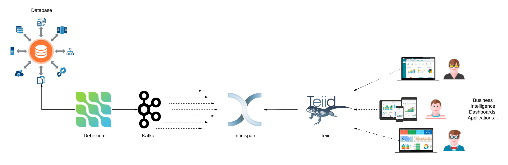

# Change Data Capture Architecture

## Introduction

Nowadays, with the increase of competition, companies and organizations need to be as updated as possible, and react to market trends as quickly as possible.
React to changes has always been a trade off in IT between performance, and  systems coupling and dependencies.

In databases, change data capture (CDC) is a set of software design patterns used to determine (and track) the data that has changed so that action can be taken using the changed data.

Methods:
* LAST_UPDATED
* diff
* Triggers
* Transaction log

Since decades, reacting to changes occured on databases introduced a lot of legacy SQL code, for the joys of the vendors. Most of the code was specific per database platform.

Today, however, IT evolved, new platforms came out with different approaches, paradigme and patterns.
Now, an event/change in a database can be captured and notified to other systems in real time as a message. Such capability is the real enabler for many use cases, such as:
* Replicate data/database
* Migrate to a new database platform
* Minimizing Time-Consuming Batch Processing
* Update distributed caching
* Real-Time Analytics
* Data Integration
* Regulations - GDPR, PSD2, SCA, 3DS 2.0
* Reactive Microservice Architectures

Every event that happens in a datastore can be captured and notified to other systems.

Opensource technologies like Debezium, Apache Kafka and Infinispan can play together to deliver a Change Data Capture Architecture that enables the above mentioned use cases.

##  The Architecture
The architecture proposed is the following:

### Database platform
Database platforms provides different ways to promote data changes. Triggers and ETL have been around since decades, providing such feature.
The easiest way is to enable any data changes it to use the transaction log.

### Debezium
Debezium enables such feature by reading the transaction log of the database platform. Every time a record is inserted, updated, deleted, or the structure of the table charges, the alteration is first written into the transaction log and the committed physically into the datastore.

### Apache Kafka
Apache Kafka is the de-facto standard for building real-time data pipelines and streaming apps. It is horizontally scalable, fault-tolerant, wicked fast, and runs in production in thousands of companies.

### Infinispan

Infinispan is an extremely scalable, highly available key/value data store and data grid platform. It is 100% open source, and written in Java. The purpose of Infinispan is to expose a data structure that is distributed, highly concurrent, designed ground-up to make the most of modern multi-processor and multi-core architectures.

### Teiid

Teiid offers a relational abstraction of all information sources that is highly performant and allows for integration with your existing relational tools. Teiid has an accompanying easy-to-use design tool that enables data architects to integrate disparate information in minutes.

## Logical Architecture
The logical architecture proposed is the following:

The database gets ingested by heterogeneous systems (crm, billing, batches, apps), and it writes everything onto the transaction logs.

Debezium reads the transaction log (remote connection), captures the changes and sends them to Apache Kafka cluster.

Apache Kafka receive the new changes and stores them into its brokers (topic, partition). At this point any Apache Kafka consumer can receive the notification of the change occurred into the database. Any consumer can receive the changes occured into the database since the beginning, since the last time it was connected, only the last change occurred for such record (identified by its primary key).

This solution proposes Infinispan as the external system which receives the notification.
Infinispan, as quickly mentioned above, is an in-memory database which has great performance and extremely scalable. For this reasons is the best candidate to host all the data changes. With its key/value data structure can be queried by any HTTP cabable applications, and thanks to its distexec mechanism can return data in milliseconds.

The architecture provides an additional layer, Teiid, which can be considered optional as it adds a SQL relational view of the Infinispan data, and can expose those data using different protocols, such as HTTP, SOAP, OData (v2 and v4), JDBC, and ODBC.

## Demo

Here is a little demo setup using containers for Microsoft SQL Server, Apache Zookeeper, Apache Kafka, Kafka Connect for Debezium and Infinispan Sink Connector, Infinispan and Teiid.

Or download the WEB Movie form [here](https://github.com/foogaro/change-data-capture/raw/master/images/demo.webm).

